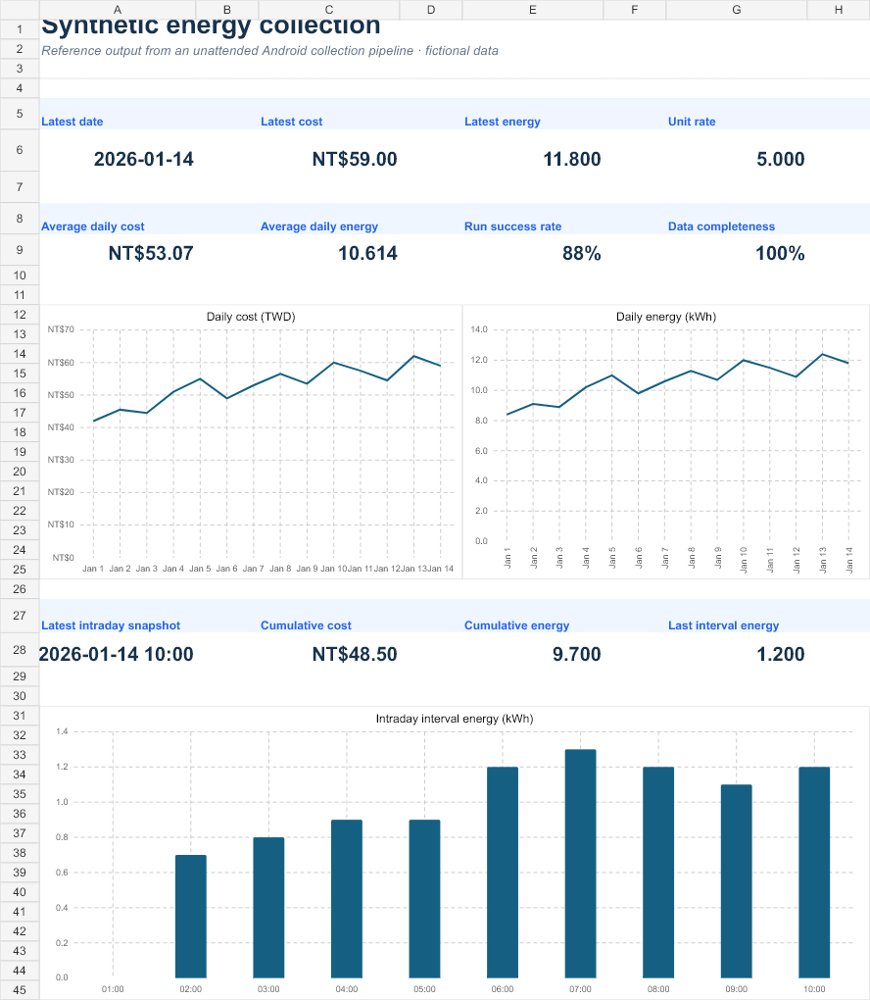
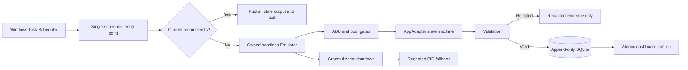

# Unattended Android Automation Toolkit

[](https://github.com/chuanchihsu1219/unattended-android-automation-toolkit/actions/workflows/tests.yml)
[](LICENSE)

A reliability-first reference implementation for collecting structured data from Android apps on an unattended Windows laptop. It combines a headless Android Emulator, ADB, an adapter boundary for UI automation, validation, append-only SQLite storage, redacted evidence, and Task Scheduler recovery.

This repository contains only generic code and synthetic data. It does not include a third-party APK, production selectors, credentials, screenshots, or user data.



## What this demonstrates

- Headless Emulator ownership scoped to an exact AVD, serial, and recorded PID.
- Four boot gates: ADB device state, Android boot completion, package manager readiness, and validated network.
- Bounded subprocess timeouts and retry for transient cold-boot stalls.
- An `AppAdapter` protocol that keeps vendor-specific UI logic outside the reusable core.
- Validation before persistence, including numeric ranges and cross-metric reconciliation.
- First validated success wins, plus append-only manual superseding with a reason.
- Redacted per-attempt evidence and cleanup that still runs after UI or validation failures.
- Windows scheduling patterns for sleep, battery power, missed triggers, and logon recovery.
- A formula-driven Excel example built entirely from synthetic observations.

## Architecture



The reusable package stops at the adapter boundary. A production integration supplies its own selectors, screen states, authentication steps, and extraction rules without exposing them here.

## Quick start

The deterministic demo does not require Android:

```powershell
py -3.12 -m venv .venv
.\.venv\Scripts\python.exe -m pip install -e ".[test]"
.\.venv\Scripts\python.exe -m pytest -q
.\.venv\Scripts\python.exe -m android_automation_toolkit demo
```

The demo writes a local, Git-ignored SQLite database and a redacted evidence folder under `runtime/demo/`. Re-running it demonstrates idempotency: the same subject and observation timestamps remain single current validated records.

To test a real AVD without adopting an existing Emulator:

```powershell
.\scripts\dev\test-headless-boot.ps1 `
  -AvdName Automation_API36 `
  -Package com.example.app `
  -CaptureState
```

## Repository map

```text
src/android_automation_toolkit/  Generic lifecycle, validation, storage, and evidence
scripts/dev/                     Safe ADB discovery and reliability tools
scripts/register-example-task.ps1  Task Scheduler reference configuration
tests/                           Failure, idempotency, cleanup, and redaction tests
docs/architecture.md             Component boundaries and state transitions
docs/engineering-decisions.md    Human-owned product and reliability decisions
docs/development-playbook.md     Emulator and UI automation failure modes
docs/ai-assisted-development.md  Transparent authorship and verification model
outputs/portfolio-demo/          Synthetic Excel artifact for review
```

## Engineering decisions

| Decision | Why it matters |
|---|---|
| Separate settled and intraday observations | Prevents an in-progress cumulative value from being mistaken for a final daily record. |
| Skip the midnight trigger | Removes date-boundary ambiguity; the next settled record represents the prior day. |
| Validate before canonical storage | UI presence is not proof of correct subject, date, metric type, or numeric consistency. |
| Keep all failed attempts | A failure should improve diagnosis without overwriting the last known-good record. |
| Treat sleep and reboot as normal states | `WakeToRun`, `StartWhenAvailable`, logon recovery, and bounded retries make a laptop deployment operationally credible. |
| Never take over an arbitrary Emulator | Exact serial and PID ownership prevents collateral damage to other Android development sessions. |

See [the decision record](docs/engineering-decisions.md) for the reasoning and acceptance checks behind these choices.

## Synthetic Excel example

The checked-in [synthetic workbook](outputs/portfolio-demo/synthetic-energy-dashboard.xlsx) contains:

- `Dashboard`: latest date, cost, energy, rate, averages, completeness, and trends.
- `Daily Data`: validated synthetic observations with run IDs.
- `Run Audit`: successful and failed synthetic attempts.
- `Data Dictionary`: definitions, validation rules, and provenance.
- `Chart Data`: compact helper ranges with auditable chart inputs.

All inputs are fictional and labeled synthetic. The workbook is a review artifact, not a production export.

## Project ownership and AI assistance

This project used AI-assisted implementation. The project owner contributed the problem definition, operating constraints, product decisions, risk boundaries, acceptance criteria, and iterative review. An OpenAI Codex coding agent assisted with implementation, tests, documentation, and debugging.

The repository does not present generated code as unaided manual authorship. Engineering ownership is demonstrated through the decision record, explicit tradeoffs, reproducible tests, and the ability to explain and operate the system. See [AI-assisted development](docs/ai-assisted-development.md).

## Security and responsible use

- Keep credentials in ignored local environment files or a secret manager.
- Redact logs, XML, exceptions, and command arguments before writing evidence.
- Do not retain authentication screenshots or UI hierarchies containing secrets.
- Use only apps, accounts, and data you are authorized to automate.
- Review the target service's terms, rate limits, and data-handling requirements.
- Do not distribute APKs, proprietary UI assets, or vendor-specific selectors without permission.

Read [SECURITY.md](SECURITY.md) before adapting the toolkit to a real app.

## Scope

This is a reference architecture, not a universal Android scraper. Real adapters still need UI discovery, stable selectors, login-state handling, and app-specific validation. CAPTCHA, OTP, and account recovery should remain explicit human checkpoints.

## License

The generic toolkit is available under the [MIT License](LICENSE). Third-party apps, services, trademarks, and data remain subject to their own terms and rights.
