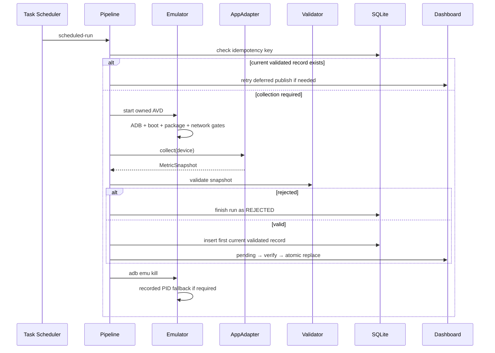

# Architecture

## Design objective

Run a deterministic Android data collection workflow on an ordinary Windows laptop without visible windows, desktop input, duplicate canonical records, or untraceable failures.

## Component boundaries

| Layer | Responsibility | Must not do |
|---|---|---|
| Scheduler | Trigger a single hidden entry point and recover after sleep or logon | Decide UI state or edit stored observations |
| Emulator manager | Own one AVD, serial, and PID; enforce boot and shutdown gates | Kill unrelated Emulator processes |
| App adapter | Navigate one authorized app and return a typed snapshot | Write canonical data directly |
| Validator | Check identity, range, type, and metric relationships | Repair or silently coerce invalid values |
| Store | Preserve runs and validated observations transactionally | Delete failed attempts or historical versions |
| Evidence writer | Produce redacted, per-attempt diagnostics | Persist authentication screenshots or raw secrets |
| Publisher | Build a pending artifact, verify it, then atomically replace | Make a successful scrape fail because a workbook is open |

## Lifecycle



## Adapter contract

The reusable package deliberately knows nothing about a target app's text, resource IDs, authentication, or screen layout.

```python
class AppAdapter(Protocol):
    name: str

    def collect(self, device: ManagedDevice) -> MetricSnapshot:
        ...
```

A private production repository implements this protocol with its own selectors and state machine. The public repository remains useful without distributing proprietary UI details.

## Persistence semantics

`runs` records every attempt. `observations` stores validated versions.

- `(observed_at, subject)` is the canonical identity.
- A partial unique index permits only one current validated version.
- Repeated successful collection returns the existing record.
- Manual repair inserts a new version with a reason and `supersedes_id`.
- Rejected and failed runs remain auditable without becoming observations.

## Trust boundaries

```text
Local secrets ──redactor──> commands / logs / XML / errors
                              │
Authorized app ──adapter──> typed snapshot ──validator──> canonical SQLite
                              │                       │
                              └── evidence only <────┘ rejection
```

The framework reduces accidental leakage; it does not grant permission to automate a service. The operator remains responsible for authorization, terms, rate limits, and retention.
